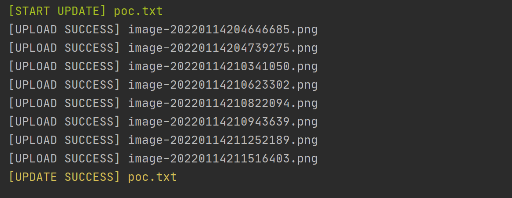

## PocUtil

> 方便从md文件到edusrc漏洞报告的快速转换

配置文件：

	

`image_path`填入Typora等md编辑工具默认图片保存目录。

使用说明：

1. 将md格式文件保存在`old_poc`目录下：

2. 命令行执行`python get_poc.py`将自动上传文件中图片并转换格式

   	

3. 复制`new_poc`中生成的同名文件提交即可

